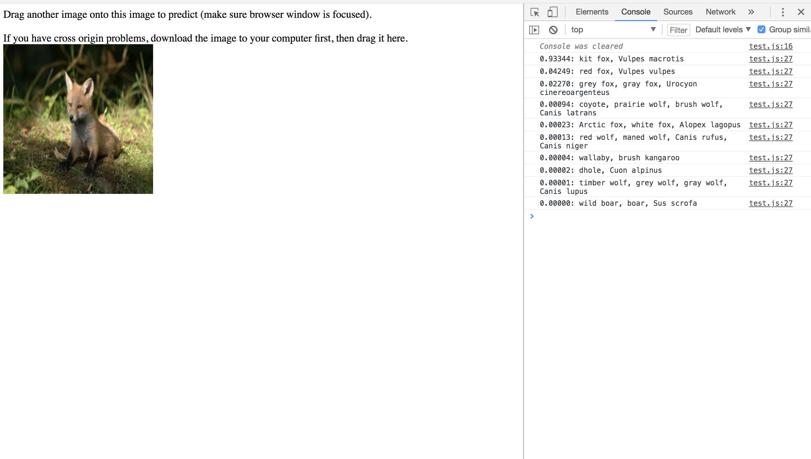

# deeplearnjs-image-classifier

Quick drag-and-drop demo that classifies the image you drop into the browser via console.log

  

This uses SqueezeNet through DeepLearnJS: https://unpkg.com/deeplearn-squeezenet
